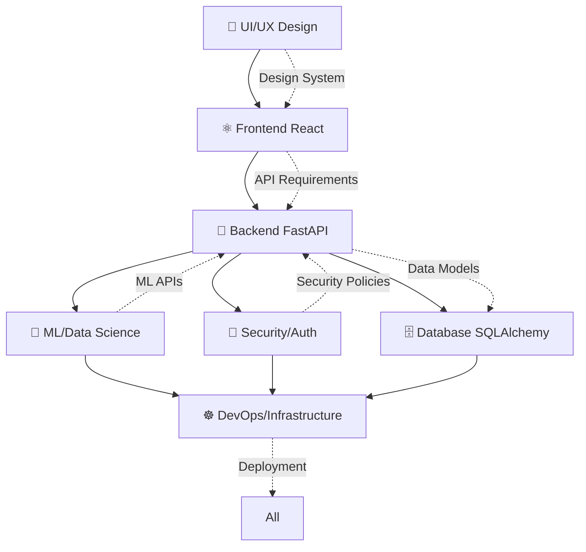

# 🤖 MLOps Platform - Equipe de Agentes Especializados

## 🎯 Visão Geral

Esta pasta contém a definição de uma equipe de agentes de desenvolvimento especializados na stack tecnológica do **MLOps Platform**. Cada agente representa um especialista em uma área específica da arquitetura, com conhecimento profundo das tecnologias, padrões e melhores práticas utilizadas no projeto.

## 👥 Equipe de Agentes

### 🐍 [Backend Python/FastAPI](./backend-python-fastapi.md)
**Especialidade**: FastAPI, SQLAlchemy, Authentication & APIs  
**Responsabilidades**:
- Desenvolvimento de APIs REST com FastAPI
- Implementação de autenticação JWT e OAuth2
- Gestão de modelos SQLAlchemy e migrations
- Integração com MLflow e serviços MLOps
- Performance optimization e caching

**Stack Principal**: `FastAPI` • `SQLAlchemy` • `Pydantic` • `JWT` • `Redis` • `MLflow`

---

### ⚛️ [Frontend React/TypeScript](./frontend-react-typescript.md) 
**Especialidade**: React, TypeScript, Next.js, UI/UX  
**Responsabilidades**:
- Desenvolvimento de interfaces React com TypeScript
- Implementação de componentes com Tailwind CSS
- Gestão de estado com React Query e Context
- Forms avançados e validação
- Data visualization para MLOps

**Stack Principal**: `React 18` • `Next.js 14` • `TypeScript` • `Tailwind CSS` • `React Query` • `Shadcn/UI`

---

### 🗄️ [Database/SQLAlchemy](./database-sqlalchemy.md)
**Especialidade**: PostgreSQL, SQLAlchemy, Data Modeling, Performance  
**Responsabilidades**:
- Design e otimização de schemas relacionais
- Implementação de modelos SQLAlchemy 2.0
- Gestão de migrations com Alembic
- Query optimization e indexing
- Multi-tenancy e data isolation

**Stack Principal**: `PostgreSQL` • `SQLAlchemy 2.0` • `Alembic` • `Redis` • `Performance Tuning`

---

### ☸️ [DevOps/Infrastructure](./devops-infrastructure.md)
**Especialidade**: Docker, Kubernetes, CI/CD, Cloud Infrastructure  
**Responsabilidades**:
- Containerização e orquestração Kubernetes
- CI/CD pipelines e deployment automation
- Infrastructure as Code (Terraform)
- Monitoring com Prometheus/Grafana
- Security e compliance em produção

**Stack Principal**: `Docker` • `Kubernetes` • `Terraform` • `GitHub Actions` • `Prometheus` • `Grafana`

---

### 🧠 [ML/Data Science](./ml-data-science.md)
**Especialidade**: MLflow, Model Training, Data Pipelines, ML Engineering  
**Responsabilidades**:
- Model development e experiment design
- Feature engineering e data pipelines
- MLflow integration e model registry
- Data drift detection e monitoring
- Automated retraining pipelines

**Stack Principal**: `MLflow` • `Scikit-learn` • `XGBoost` • `Pandas` • `Optuna` • `SHAP` • `Evidently`

---

### 🔐 [Security/Authentication](./security-authentication.md)
**Especialidade**: JWT, OAuth2, RBAC, Security Auditing, Compliance  
**Responsabilidades**:
- Sistema de autenticação e autorização
- Multi-tenant security e data isolation
- API key management e rate limiting
- Security auditing e compliance (GDPR)
- Vulnerability assessment e protection

**Stack Principal**: `JWT` • `OAuth2` • `RBAC` • `Security Middleware` • `Audit Logging` • `Encryption`

---

### 🎨 [UI/UX Design](./ui-ux-design.md)
**Especialidade**: Design Systems, User Experience, Accessibility, Design Tokens  
**Responsabilidades**:
- Design system e component library
- User experience optimization
- Accessibility implementation (WCAG 2.1)
- Data visualization design
- MLOps workflow simplification

**Stack Principal**: `Design Systems` • `Tailwind CSS` • `Accessibility` • `Component Patterns` • `Data Viz`

---

## 🏗️ Arquitetura de Colaboração

### 🔄 Workflows de Desenvolvimento



### 🤝 Responsabilidades Cruzadas

| Funcionalidade | Agente Principal | Agentes Colaboradores |
|---|---|---|
| **Model Registry** | 🧠 ML/Data Science | 🐍 Backend, 🗄️ Database, ⚛️ Frontend |
| **Authentication** | 🔐 Security/Auth | 🐍 Backend, ⚛️ Frontend, 🗄️ Database |
| **Deployment Pipeline** | ☸️ DevOps | 🐍 Backend, 🧠 ML/Data Science |
| **Monitoring Dashboard** | ⚛️ Frontend | 🎨 UI/UX, 🐍 Backend, 🧠 ML/Data Science |
| **Database Performance** | 🗄️ Database | 🐍 Backend, ☸️ DevOps |
| **User Experience** | 🎨 UI/UX Design | ⚛️ Frontend, 🔐 Security |

---

## 📋 Protocolos de Desenvolvimento

### 🎯 Standards de Qualidade
- **Code Coverage**: >80% para todos os componentes críticos
- **Type Safety**: TypeScript strict mode, Python type hints
- **Security**: Security scanning e audit em todas as PRs
- **Performance**: Load testing e optimization requirements
- **Accessibility**: WCAG 2.1 AA compliance mínima
- **Documentation**: Código auto-documentado e README atualizado

### 🧪 Testing Strategy
```typescript
// Testing responsibilities por agente
const testingMatrix = {
  "Backend FastAPI": [
    "Unit tests (pytest)",
    "Integration tests (TestClient)",
    "API contract tests",
    "Performance tests (load testing)"
  ],
  "Frontend React": [
    "Component tests (React Testing Library)",
    "Integration tests (Playwright)",
    "Visual regression tests (Chromatic)",
    "Accessibility tests (jest-axe)"
  ],
  "Database SQLAlchemy": [
    "Migration tests",
    "Query performance tests", 
    "Data integrity tests",
    "Constraint validation tests"
  ],
  "DevOps Infrastructure": [
    "Infrastructure tests (Terratest)",
    "Container security scans",
    "Deployment smoke tests",
    "Disaster recovery tests"
  ],
  "ML/Data Science": [
    "Model validation tests",
    "Data pipeline tests",
    "Drift detection tests", 
    "A/B testing statistical validation"
  ],
  "Security/Auth": [
    "Security penetration tests",
    "Authentication flow tests",
    "Authorization tests",
    "Compliance validation tests"
  ]
};
```

### 🚀 Deployment Workflow
1. **Development**: Feature development em branches
2. **Code Review**: Review por agente especialista + peers
3. **Testing**: Automated testing em todas as camadas
4. **Staging Deployment**: Deploy automatizado para staging
5. **User Acceptance**: Testing com usuários reais
6. **Production Deployment**: Blue-green deployment
7. **Monitoring**: Post-deployment monitoring e alerts

---

## 🛠️ Stack Tecnológica Unificada

### 📊 Technology Matrix

| Categoria | Tecnologias | Agentes Responsáveis |
|---|---|---|
| **Backend** | FastAPI, SQLAlchemy, Pydantic, JWT | 🐍 Backend, 🗄️ Database, 🔐 Security |
| **Frontend** | React 18, Next.js 14, TypeScript, Tailwind | ⚛️ Frontend, 🎨 UI/UX |
| **Database** | PostgreSQL, Redis, SQLAlchemy, Alembic | 🗄️ Database, 🐍 Backend |
| **ML/MLOps** | MLflow, Scikit-learn, XGBoost, Evidently | 🧠 ML/Data Science |
| **Infrastructure** | Docker, Kubernetes, Terraform, Prometheus | ☸️ DevOps |
| **Security** | JWT, OAuth2, RBAC, Audit Logging | 🔐 Security/Auth |
| **Design** | Tailwind, Shadcn/UI, Design Tokens, A11y | 🎨 UI/UX, ⚛️ Frontend |

### 🔧 Development Dependencies
```json
{
  "backend": {
    "runtime": "Python 3.11+",
    "framework": "FastAPI 0.104+",
    "database": "PostgreSQL 15+",
    "cache": "Redis 7+",
    "ml": "MLflow 2.8+"
  },
  "frontend": {
    "runtime": "Node.js 18+",
    "framework": "Next.js 14+",
    "language": "TypeScript 5+",
    "styling": "Tailwind CSS 3+",
    "state": "React Query 5+"
  },
  "infrastructure": {
    "container": "Docker 24+",
    "orchestration": "Kubernetes 1.28+",
    "iac": "Terraform 1.5+",
    "monitoring": "Prometheus 2.45+"
  }
}
```

---

## 🎯 Como Usar Esta Equipe

### 📝 Solicitando Ajuda de Agentes
Quando precisar de ajuda específica, referencie o agente apropriado:

```bash
# Exemplos de como solicitar ajuda específica:

# Para implementar nova API
"@backend-python-fastapi: Preciso implementar a API de inferência de modelos com rate limiting e cache"

# Para otimizar query do banco
"@database-sqlalchemy: Esta query está lenta, preciso otimizar para buscar modelos com suas métricas"

# Para criar componente React  
"@frontend-react-typescript: Preciso de um componente para comparar múltiplos experimentos side-by-side"

# Para configurar deployment
"@devops-infrastructure: Preciso configurar auto-scaling para os model serving pods no Kubernetes"

# Para implementar feature de ML
"@ml-data-science: Preciso implementar detecção de data drift usando Evidently"

# Para revisar segurança
"@security-authentication: Preciso revisar o sistema de API keys e implementar rotação automática"

# Para melhorar UX
"@ui-ux-design: O fluxo de upload de modelos está confuso, precisa ser simplificado"
```

### 🔄 Workflow de Colaboração
1. **Identifique o domínio**: Determine qual agente é o especialista principal
2. **Consulte documentação**: Revise o arquivo do agente para entender capabilities
3. **Defina escopo**: Especifique claramente o que precisa ser implementado
4. **Considere dependências**: Identifique agentes colaboradores necessários
5. **Execute e valide**: Implemente com guidance do agente especialista

---

## 📈 Métricas de Sucesso da Equipe

### 🎯 KPIs Técnicos
- **Code Quality**: >90% test coverage, 0 critical security vulnerabilities
- **Performance**: <200ms API response time, >99.9% uptime
- **User Experience**: <3 clicks para operações principais, >8/10 usability score
- **Security**: 0 data breaches, 100% compliance com GDPR
- **Deployment**: <5min deployment time, 0 rollbacks por bugs críticos

### 📊 Métricas de Produtividade
- **Feature Delivery**: 2-week sprints, 95% story completion
- **Bug Resolution**: <24h para bugs críticos, <1 week para features
- **Documentation**: 100% API documentation, 90% code documentation
- **Knowledge Sharing**: Cross-training entre agentes
- **Innovation**: 1 tech improvement por sprint

---

## 🚀 Roadmap da Equipe

### 🔄 Próximas Evoluções
1. **AI-Powered Agents**: Integration com LLMs para code generation
2. **Automated Testing**: AI-powered test generation
3. **Predictive Monitoring**: ML-based performance prediction
4. **Self-Healing Systems**: Automated issue resolution
5. **Advanced Analytics**: Business intelligence dashboard

### 🎓 Continuous Learning
- **Weekly Tech Talks**: Sharing de conhecimento entre agentes
- **Quarterly Reviews**: Retrospectives e improvement planning
- **Technology Radar**: Avaliação de novas tecnologias
- **Certification Tracking**: Professional development goals
- **Open Source Contributions**: Community involvement

---

## 📞 Contato & Escalação

### 🆘 Quando Precisar de Ajuda
1. **Consulte o agente específico** da área usando `@agente-nome`
2. **Para problemas complexos**, envolva múltiplos agentes
3. **Para emergências de produção**, contate `@devops-infrastructure` primeiro
4. **Para questões de segurança**, sempre inclua `@security-authentication`

### 🔄 Processo de Escalação
1. **L1 - Agente Especialista**: Problema específico da área
2. **L2 - Agentes Colaboradores**: Problema cross-functional  
3. **L3 - Architecture Review**: Mudanças significativas na arquitetura
4. **L4 - Tech Lead Review**: Decisões estratégicas de tecnologia

---

## 📚 Recursos Adicionais

### 📖 Documentação Relacionada
- [`docs/technical/`](../mlops-platform/docs/technical/) - Arquitetura técnica detalhada
- [`docs/planning/`](../mlops-platform/docs/planning/) - Planejamento e roadmap  
- [`docs/development/`](../mlops-platform/docs/development/) - Guias de desenvolvimento

### 🔗 Links Úteis
- **Repositório Principal**: `mlops-platform/`
- **Backend API**: `mlops-platform/backend/`
- **Frontend App**: `mlops-platform/frontend/`
- **Infrastructure**: `mlops-platform/infrastructure/`
- **Documentation**: `mlops-platform/docs/`

### 🎯 Quick Start
```bash
# Clone o repositório
git clone <repo-url> mlops-platform
cd mlops-platform

# Setup desenvolvimento (Docker)
docker-compose up -d

# Setup backend
cd backend
python -m venv venv
source venv/bin/activate  # ou `venv\Scripts\activate` no Windows
pip install -r requirements.txt
alembic upgrade head

# Setup frontend  
cd ../frontend
npm install
npm run dev

# Acesse a aplicação
open http://localhost:3000
```

---

*Esta equipe de agentes foi projetada para maximizar a eficiência de desenvolvimento, garantindo expertise especializado em cada área crítica da plataforma MLOps, enquanto mantém colaboração fluida entre domínios.*

**Versão**: 1.0.0  
**Última Atualização**: 2024-08-30  
**Próxima Revisão**: 2024-09-30